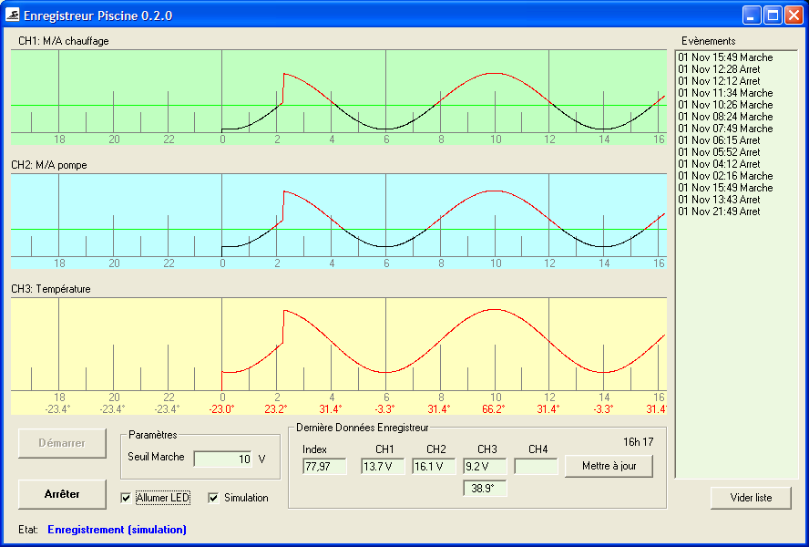
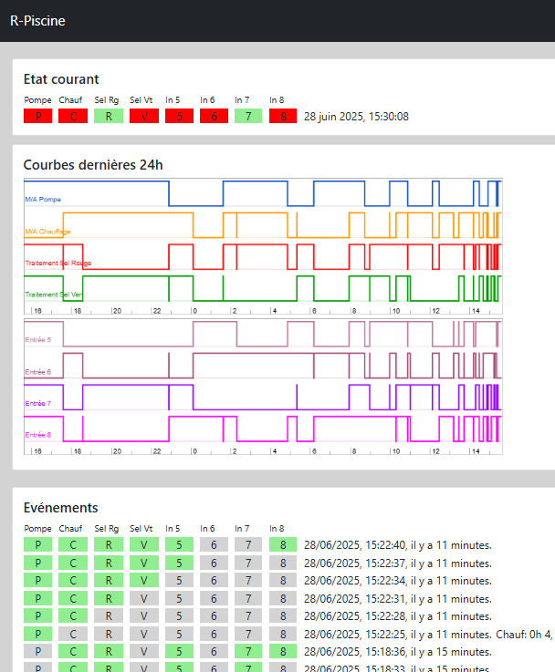
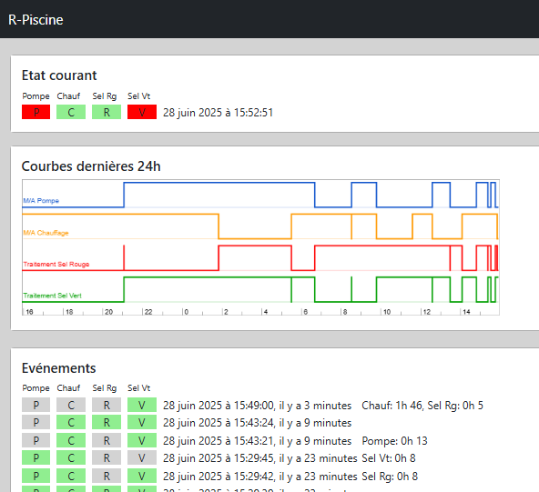

## 2012: Enregistreur Piscine VB

Source: [Enregisteur_Piscine_VB](Enregisteur_Piscine_VB/)

Enregistreur piscine basé sur un enregistreur 4-canaux
[Velleman PCS10/K8047](http://www.velleman.eu/distributor/products/view/?id=350526)
et un capteur de température
[Velleman K8067](http://www.velleman.eu/distributor/products/view/?id=354616).

*Code license:* GNU GPL v3

### Screenshot ###

### Références ###

enregistreur 4-canaux | capteur de température
:----------------------------:|:------------------------------:
[Velleman PCS10/K8047](http://www.velleman.eu/distributor/products/view/?id=350526) |[Velleman K8067](http://www.velleman.eu/distributor/products/view/?id=354616)
 | 

## 2021: Hublot, React JS

Source: [Hublot](react/hublot/)

Node JS: 14.11.0

*Code license:* GNU GPL v3

### Screenshot ###

### Hardware ###

[Raspberry Pi 1 B+](https://www.raspberrypi.com/products/raspberry-pi-1-model-b-plus/) | [PiFace Digitalio](https://wiki.domoticz.com/PiFace)
:---------------:|:-------:
 | 

## 2025: Hublot 2, React, TypeScript, Vite

Source: [Hublot 2](react/hublot2/)

Node JS: 24.0.0

*Code license:* GNU GPL v3

### Screenshot ###

### Hardware ###

[Raspberry Pi 4 B](https://www.raspberrypi.com/products/raspberry-pi-4-model-b/) | [PiFace Digitalio](https://wiki.domoticz.com/PiFace)
:---------------:|:-------:
 | 

PiFace can be used on a [Raspberry Pi 4](https://en.wikipedia.org/wiki/Raspberry_Pi_4) using the
forked [github.com/ralfoide/pifacecommon](https://github.com/ralfoide/pifacecommon) librrary.

## License

GNU GPL v3

[GNU General Public License version 3
](https://opensource.org/license/gpl-3-0)

~~
